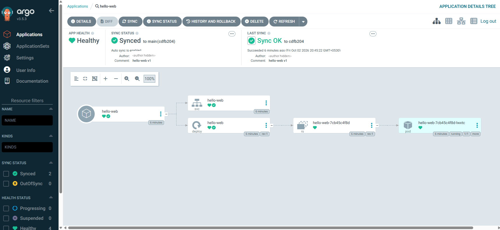

# 02 — First app: deploy by git push

**Goal:** ArgoCD keeps the target cluster equal to what's in git.

**Run**
1. Create an empty repo `deploy-demo` on the git server; push `k8s/` into it
   (set `image:` to your `hello-web:<sha7>` tag).
2. Set `repoURL` and `destination.name` in `app.yaml`, then on the **ArgoCD** cluster:
   `kubectl apply -f app.yaml`

**Expect:** ArgoCD UI → `hello-web` **Synced · Healthy**, destination `edge-cluster`.
`curl <any-target-node>:30090` → `hello-web v1`.

**Next:** [03](../03-drift-selfheal-prune-rollback/) — scale it, break it, heal it, roll it back.

**Faster than polling:** see [12](../12-webhook-instant-sync/).
